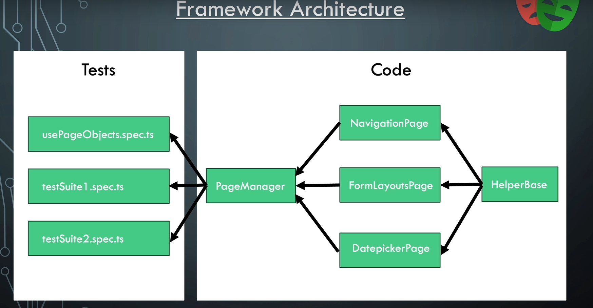

# Playwright test automation

## Project overview
The project is based on the [Playwright](https://playwright.dev) framework.

### Why?
As Pink roccade local government QA, we require the ability to run repetitive and complex E2E test cases while focusing on the testing of new features as well as implement exploratory testing for existing features. We also require the ability to create automation tests as fast as possible and as effectively as possible.

### How?
The end goal, using the playwright framework is to efficiently and swiftly automate repetitive test runs based on E2E test cases within our Test Management System.
We do so by utilizing playwright's powerful features and automation tools which in turn allows us to create a framework that is easy to maintain and extend.

## 1. Dependencies
1.1 Node.js installation: https://nodejs.org/en/download/package-manager \
1.2 Playwright installation: https://playwright.dev/docs/intro

## Programming language used
- Typescript

The reasoning behind using TypeScript is due to its simplicity and ease of use. TypeScript is also a strongly typed language that builds on JavaScript which gives us the ability to describe our data by using types which we can then use in our code. The usage of types also allows us to avoid errors in our code making the development of test automation features and tests more reliable and efficient.

## Architecture overview


## Coding practices

### S.O.L.I.D. principles

Our test automation frameworks should always adhere to the [S.O.L.I.D](https://www.digitalocean.com/community/conceptual-articles/s-o-l-i-d-the-first-five-principles-of-object-oriented-design) principles.

### The D.R.Y principle

Our test automation frameworks should always adhere to the [D.R.Y](https://thevaluable.dev/dry-principle-cost-benefit-example/) principle.

## Getting started
- Clone the repository: `git clone https://github.com/pink-roccade/pink-roccade-test-automation.git`
- Install Node.js
- Install Playwright

## Creating an automation test

In the below test example, we have a rather straight forward end to end test. This is an exanple of how we can use our test functions as intended. There is no over complication in the implementation other than focusing on the main objective by executing the test case.

``` typescript
    test('navigate to and verify werken bij page header', async ({ page }) => {
        const pm = new PageManager(page);

        await pm.onPrHomePage().clickWerkenBijLink();
        expect(await pm.onWerkenBijPage().verifyWerkenBijHeaderIsVisible()).toBe(true);
    });
```

## Page object model implementation

When creating a new test suite, we sometimes have to implement a Page object model (POM) class which focusses on functionality of the page that we are testing. A POM class can be named something like WerkenBijPage.ts as an example. 

``` typescript
// Imports for POM
import { Locator, Page } from "@playwright/test";
import { HelperBase } from "./helperBase";

// Implementation of POM
export class WerkenBijPage extends HelperBase {

    // Locators
    readonly page: Page
    readonly werkenBijLink: Locator
    readonly werkenBijHeader: Locator

    // Constructor with locator strategy
    constructor(page: Page) {
        super(page);
        this.page = page;
        this.werkenBijHeader = page.getByRole('heading', { name: 'Werken bij'});
    }

    // Helper functions to use within test classes
    async clickWerkenBijLink() {
        await this.werkenBijLink.click();
    }
    async verifyWerkenBijHeaderIsVisible(): Promise<boolean> {
        return await this.werkenBijHeader.isVisible();
    }
}
```

## Page manager class

The purpose of the page manager or pagemanager.ts class is to provide a single location for all the pages. This allows us to only instantiate one instance of the page manager class in the test suite and call any function from any POM class within our test suite classes thus adhering to the D.R.Y principle and keeping complexity to a minimum.

``` typescript
// Imports
import { Page } from '@playwright/test';
import { PRHomePage } from './prhomepage';
import { WerkenBijPage } from './werkenBijPage';

// Implementation
export class PageManager {
    // Page objects
    private readonly page: Page;
    private readonly prHomePage: PRHomePage;
    private readonly werkenBijPage: WerkenBijPage;

    // Constructor with page object assingment
    constructor(page: Page) {
        this.page = page;
        this.prHomePage = new PRHomePage(this.page);
        this.werkenBijPage = new WerkenBijPage(this.page);
    }

    // Page object functions
    onPrHomePage() {
        return this.prHomePage;
    }

    onWerkenBijPage() {
        return this.werkenBijPage;
    }
}
```

Usage in a test function:

``` typescript
    test('navigate to and verify werken bij page header', async ({ page }) => {
        const pm = new PageManager(page); // Page Manager instansiation

        await pm.onPrHomePage().clickWerkenBijLink(); // Calling the onPrHomePage().clickWerkenBijLink() function
        expect(await pm.onWerkenBijPage().verifyWerkenBijHeaderIsVisible()).toBe(true); // Calling the onWerkenBijPage().verifyWerkenBijHeaderIsVisible() function and asserting the result
    });
```

## Helper base class

The intent of the helper base or helperBase.ts class is to create utility helper functions to be used within the POM classes. This can be anything we require to assist us with action functions in a POM class. In the below example we can see that a function exists to wait for a certain amount of time.

``` typescript
// Imports
import { Page } from "@playwright/test";

// Implementation
export class HelperBase {

    readonly page: Page;

    constructor(page: Page) {
        this.page = page;
    }

    // Helper functions
    async waitForNumberOfSeconds(seconds: number) {
        await this.page.waitForTimeout(seconds * 1000);
    }
}
```

## Running tests from command line

The below command will run all tests in the project
``` bash
npx playwright test
```

The below command will run a test suite
``` bash
npx playwright test tests/todo-page.spec.ts
```

Please see the [test-cli](https://playwright.dev/docs/test-cli) for more info.

## Viewing the test report

We are able to view the test report for a completed test run by navigating to the following file playwright-report\index.html